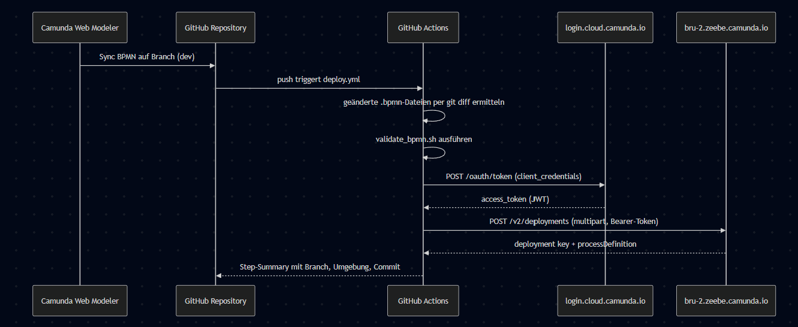
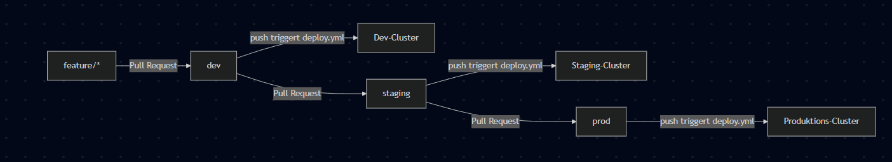
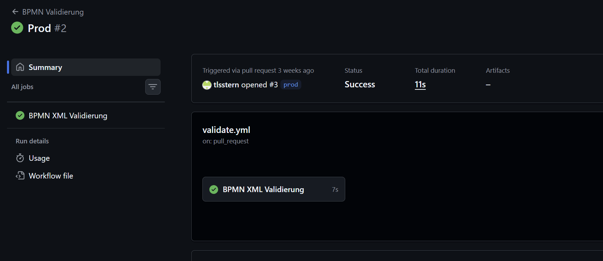
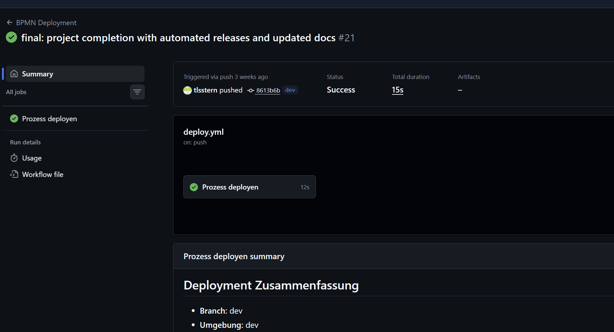
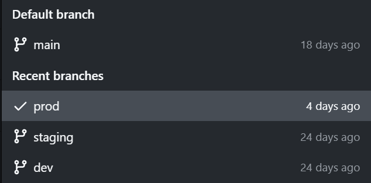
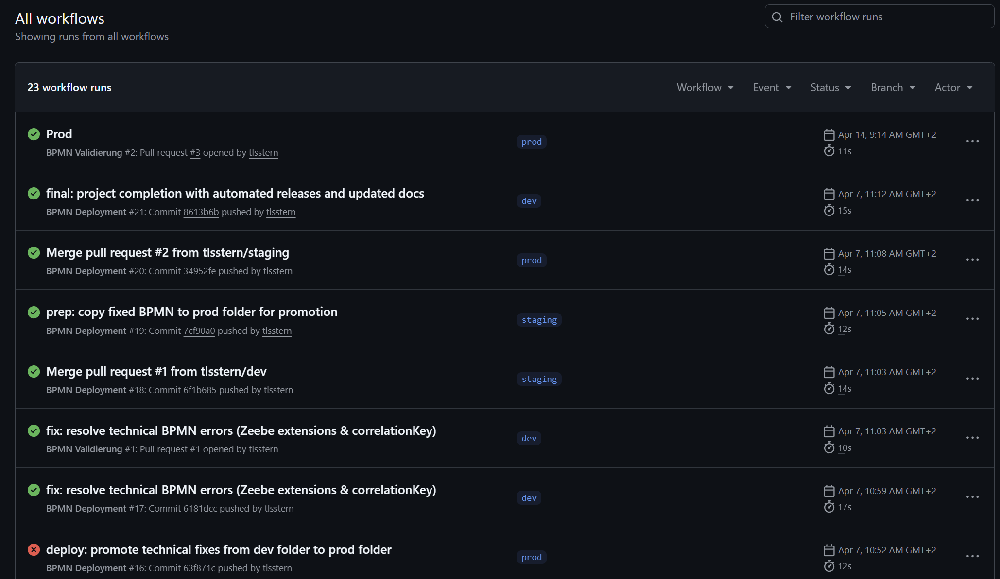

# LB3 – Dokumentation

**Modul M254 – Geschäftsprozesse | LB3 – Selbstständiger Auftrag**
**Thema:** Camunda + GitHub CI/CD Pipeline – Automatisches Deployment von BPMN-Prozessen

| Eigenschaft | Details |
| :--- | :--- |
| Lernende | Felípe Pereira, Thomas Stern |
| Klasse | AP24b |
| Lehrperson | Thomas Kälin |
| Bearbeitungszeit | April 2026 |
| Abgabe | 02.05.2026 |
| Berufsschule | Berufsschule Zürich |

---

## Inhaltsverzeichnis

1. Beschreibung des Auftrags
   1.1 Ausgangslage und Motivation
   1.2 Ziele
   1.3 Abgrenzung
   1.4 Lernprodukt
2. Vorgehen und Umsetzung
   2.1 Methodisches Vorgehen
   2.2 Aufgabenteilung im Team
   2.3 Verwendete Technologien
   2.4 Architektur und Systemüberblick
   2.5 Repository-Struktur und Branch-Strategie
   2.6 BPMN-Prozessmodell: Urlaubsantrag
   2.7 CI/CD-Pipeline mit GitHub Actions
   2.8 Lokale Entwicklungsumgebung mit Docker
3. Probleme und Lösungen
   3.1 Zeebe-Engine lehnte ausführbares BPMN ab
   3.2 Camunda REST API liefert zwei verschiedene Antwortformate
   3.3 Zeebe REST API 415 Unsupported Media Type
   3.4 Branch- und Umgebungsmodell musste konsolidiert werden
4. Test und Nachweis der Funktionsfähigkeit
5. Erkenntnisse und Fazit
   5.1 Technische Erkenntnisse
   5.2 Erkenntnisse zu Geschäftsprozessen
   5.3 Persönliche Erkenntnisse zum Modul M254
   5.4 Was wir nächstes Mal anders machen würden
   5.5 Fazit
6. Anhang
   A. Docker Compose Konfiguration (Auszug)
   B. GitHub Actions Workflow `deploy.yml`
   C. Validierungsskript `validate_bpmn.sh`
   D. Quellen

---

## 1 Beschreibung des Auftrags

### 1.1 Ausgangslage und Motivation

In modernen Softwareentwicklungsprojekten werden Änderungen an Code und Konfigurationen kontinuierlich über CI/CD-Pipelines (Continuous Integration / Continuous Deployment) ausgeliefert. Für Geschäftsprozesse, die in BPMN modelliert und in einer Process Engine wie Camunda ausgeführt werden, existiert ein analoges Bedürfnis: Prozessmodelle sollen versioniert, überprüft und automatisch in die Zielumgebung deployed werden können.

Im Modul M254 haben wir gelernt, Geschäftsprozesse mit BPMN zu modellieren und mit einer Process Engine wie Camunda auszuführen. Im Berufsalltag werden solche Prozessmodelle aber selten manuell in eine Engine geladen, sondern über automatisierte Pipelines. Diesen Schritt – vom modellierten BPMN bis in die laufende Engine – wollten wir selbst nachvollziehen und exemplarisch automatisieren.

### 1.2 Ziele

Wir haben uns folgende Ziele gesetzt:

* Einen realen, mehrschrittigen BPMN-Prozess in Camunda 8 modellieren.
* Den Camunda Web Modeler mit einem GitHub-Repository synchronisieren.
* Eine GitHub-Actions-Pipeline aufbauen, die geänderte BPMN-Dateien automatisch validiert und deployed.
* Eine drei-stufige Branch-Strategie (`dev` → `staging` → `prod`) anwenden, wie sie auch in der Software-Entwicklung üblich ist.
* Den Brückenschlag zwischen Geschäftsprozessen und Software-Engineering-Praktiken konkret zeigen.

### 1.3 Abgrenzung

Folgende Aspekte sind bewusst **nicht** Teil dieses Auftrags:

* Die Implementation produktiver Service-Worker in Java oder Node.js. Wir konfigurieren die Anbindung, schreiben aber keinen Worker-Code.
* Eine produktiv nutzbare Sicherheitskonfiguration der Camunda-Instanzen. Auth ist im lokalen Setup deaktiviert; Cloud-Credentials werden ausschliesslich über GitHub Secrets verwaltet.
* Last- oder Performance-Tests der Pipeline.

### 1.4 Lernprodukt

Das Lernprodukt besteht aus:

1. Einem öffentlichen GitHub-Repository mit BPMN-Modellen, Workflow-Dateien und Deployment-Skripten.
2. Einer aktiven Camunda-Cloud-Instanz, in der der deployte Urlaubsantragsprozess sichtbar ist.
3. Einer lokal ausführbaren Docker-Compose-Umgebung als alternative, self-managed Variante.
4. Dieser schriftlichen Dokumentation.

---

## 2 Vorgehen und Umsetzung

### 2.1 Methodisches Vorgehen

Wir haben iterativ und branch-getrieben gearbeitet. Jede grössere Änderung lief in einem Feature-Branch, wurde über Pull Requests in `dev` integriert, automatisiert validiert und nach erfolgreichem Test stufenweise nach `staging` und `prod` promoviert. Diese Arbeitsweise spiegelt den Workflow, den wir mit der Pipeline ohnehin anstrebten – wir haben also "live mit unserer eigenen Pipeline" entwickelt.

### 2.2 Aufgabenteilung im Team

| Bereich | Hauptverantwortung |
| :--- | :--- |
| BPMN-Modellierung Urlaubsantrag | Felípe |
| GitHub Actions Workflows | Thomas |
| Python-Deployment-Skript | Thomas |
| Docker-Compose Setup | Felípe |
| Tests, Branch-Promotion, Debugging | gemeinsam |
| Dokumentation | gemeinsam |

### 2.3 Verwendete Technologien

| Technologie | Version / Variante | Zweck |
| :--- | :--- | :--- |
| Camunda Platform 8 | SaaS (Region `bru-2`) und Self-Managed `8.6.5` | Process Engine und Web Modeler |
| GitHub | github.com | Versionierung, Pull Requests, Releases |
| GitHub Actions | YAML Workflows | Automatisierte Validierung und Deployment |
| Docker / Docker Compose | Docker Desktop | Lokale Camunda-8-Instanz (alternative Umgebung) |
| Camunda Zeebe REST API | v2 | Programmatisches Deployment |
| BPMN | 2.0 | Prozessmodellierung |
| Python | 3.12 | Deployment-Skript |
| Bash / `xml.etree.ElementTree` | – | Validierungsskript |
| Elasticsearch | 8.15.3 | Indizierung für Operate / Tasklist (lokal) |

### 2.4 Architektur und Systemüberblick

Der Datenfluss von der Modellierung bis zur laufenden Engine sieht so aus:



**Abbildung 1:** Sequenzdiagramm Modeler → GitHub → Camunda Cloud.

Der Camunda Web Modeler synchronisiert das BPMN per GitHub-Integration. Ein Push auf einen der drei Deployment-Branches löst den Workflow aus. Dieser holt sich per OAuth 2.0 Client Credentials einen Access-Token bei Camunda Cloud und schickt das BPMN als Multipart-Upload an die Zeebe REST API.

### 2.5 Repository-Struktur und Branch-Strategie

```
M254-Thomas/
├── .github/
│   └── workflows/
│       ├── validate.yml      # BPMN-Validierung bei Pull Requests
│       └── deploy.yml        # Automatisches Deployment bei Push
├── processes/
│   ├── dev/
│   │   └── urlaubsantrag.bpmn
│   └── prod/
│       └── urlaubsantrag.bpmn
├── scripts/
│   ├── validate_bpmn.sh      # XML-/BPMN-Strukturprüfung
│   └── deploy_process.py     # OAuth + Zeebe-REST-Upload
├── docker-compose.yml        # Self-Managed Camunda 8 Stack
└── README.md
```

Branch-Strategie:



**Abbildung 2:** Promotion eines BPMN von dev → staging → prod.

| Branch | Funktion | Quellordner | Validate-Trigger | Deploy-Trigger |
| :--- | :--- | :--- | :--- | :--- |
| `dev` | Entwicklung | `processes/dev/` | – | Push hierher |
| `staging` | Test / Vorproduktion | `processes/dev/` | Pull Request hierher | Push hierher |
| `prod` | Produktion | `processes/prod/` | Pull Request hierher | Push hierher |
| `main` | Default-Branch | – | Pull Request hierher | – |

### 2.6 BPMN-Prozessmodell: Urlaubsantrag

Als praxisnahen Beispielprozess haben wir einen **Urlaubsantrag** modelliert. Drei Pools repräsentieren die beteiligten Akteure:

* **Pool 1 – Mitarbeiter/in.** Startet mit dem Ereignis *Urlaub benötigt*. Die Mitarbeiterin füllt den Antrag aus (`User Task`), reicht ihn ein (`Send Task`) und wartet auf den Entscheid (`Intermediate Catch Event`). Über ein Exclusive Gateway *Genehmigt?* verzweigt der Prozess: Bei *Ja* plant sie den Urlaub, bei *Nein* kann sie den Antrag anpassen oder zurückziehen.
* **Pool 2 – Vorgesetzte/r.** Empfängt den Antrag, prüft ihn (`User Task`), entscheidet über Gateway *Genehmigung* (Service Tasks *Genehmigung erteilen* oder *Ablehnung mitteilen*), sendet den Entscheid an die Mitarbeiterin (`Send Task`) und benachrichtigt das HR-System.
* **Pool 3 – HR-System (automatisiert).** Empfängt die HR-Benachrichtigung, trägt bei Genehmigung Urlaubstage in die Datenbank ein (`Service Task`) und sendet eine Bestätigung zurück.

Die drei Pools kommunizieren über **vier Message Flows**:

| Message Flow | Von | Nach |
| :--- | :--- | :--- |
| `Urlaubsantrag` | Mitarbeiter | Vorgesetzter |
| `Entscheid` | Vorgesetzter | Mitarbeiter |
| `HR-Benachrichtigung` | Vorgesetzter | HR-System |
| `Bestätigung` | HR-System | Mitarbeiter |

Wir haben bewusst eine Mischung aus **User Tasks** (Mensch entscheidet) und **Service Tasks** (System führt automatisch aus) gewählt, um den realistischen Charakter eines hybriden Geschäftsprozesses abzubilden.

Das vollständige BPMN-Modell ist im Repository unter `processes/prod/urlaubsantrag.bpmn` einsehbar und kann direkt im Camunda Web Modeler oder mit einem BPMN-fähigen Editor (z. B. VS Code mit `bpmn-io`-Plugin) geöffnet werden. Auf eine eingebettete Abbildung verzichten wir bewusst, da die XML-Quelldatei im Lernprodukt (ZIP) ohnehin enthalten und damit prüfbar ist.

### 2.7 CI/CD-Pipeline mit GitHub Actions

Die Pipeline besteht aus zwei separaten Workflows.

**Workflow 1 – `validate.yml` (Pull-Request-Validierung).** Wird ausgelöst, sobald ein Pull Request `processes/**/*.bpmn` ändert. Er ruft `scripts/validate_bpmn.sh` auf und prüft:

1. ob die BPMN-Dateien wohlgeformtes XML sind (`xml.etree.ElementTree`),
2. ob der BPMN-2.0-Namespace `http://www.omg.org/spec/BPMN/20100524/MODEL` vorhanden ist,
3. ob mindestens ein `<process>`-Element existiert.

Bewusst **nicht** geprüft wird die Ausführbarkeit unter Zeebe (z. B. fehlende Zeebe-Extensions), die Vollständigkeit von Service-Task-Implementierungen oder die Referenzintegrität der Sequenz- und Message-Flows. Diese Lücke ist gewollt: die Pipeline-Validierung fängt frühe Fehler ab, ersetzt aber keinen fachlichen Review im Pull Request.

**Workflow 2 – `deploy.yml` (Deployment).** Wird ausgelöst, sobald `processes/**/*.bpmn` auf einen der drei Deployment-Branches (`dev`, `staging`, `prod`) gepusht wird. Schritte:

1. Repository auschecken (`actions/checkout@v4`, `fetch-depth: 2` für Diff).
2. Python 3.12 einrichten und `requests` installieren.
3. Umgebung ableiten (`prod` → Produktion, `staging`/`dev` → Dev-Ordner).
4. Geänderte BPMN-Dateien per `git diff HEAD~1 HEAD` ermitteln.
5. Erneute lokale Validierung mit `validate_bpmn.sh`.
6. Pro geänderter Datei: `python scripts/deploy_process.py` mit den Cloud-Credentials aus den GitHub Secrets aufrufen.
7. Step-Summary mit Branch, Umgebung und Commit-SHA in die Workflow-Run-Übersicht schreiben.

Das Python-Skript holt zuerst per OAuth 2.0 Client Credentials einen Access-Token bei `https://login.cloud.camunda.io/oauth/token` mit Audience `zeebe.camunda.io`. Anschliessend lädt es die BPMN-Datei über `POST https://{region}.zeebe.camunda.io/{cluster_id}/v2/deployments` als `multipart/form-data` hoch. Auf Erfolg liefert die API einen Deployment-Key und eine Process-Definition mit Versionsnummer zurück, die das Skript ausgibt.

### 2.8 Lokale Entwicklungsumgebung mit Docker

Als alternative, self-managed Umgebung lässt sich der gesamte Camunda-8-Stack lokal hochfahren:

```bash
docker compose up -d
```

Compose definiert fünf Services in einem gemeinsamen Netzwerk `camunda-platform`:

| Container | Image | Port (Host) | Zweck |
| :--- | :--- | :--- | :--- |
| zeebe | `camunda/zeebe:8.6.5` | 26500, 9600 | Process Engine |
| operate | `camunda/operate:8.6.5` | 8081 | Monitoring laufender Instanzen |
| tasklist | `camunda/tasklist:8.6.5` | 8082 | UI für User Tasks |
| connectors | `camunda/connectors-bundle:8.6.4` | 8085 | Vorgefertigte Konnektoren |
| elasticsearch | `elasticsearch:8.15.3` | 9200, 9300 | Index für Operate / Tasklist |

Zeebe exportiert jedes Workflow-Ereignis nach Elasticsearch (`BULK_SIZE=1`, sofortige Sichtbarkeit). Operate und Tasklist lesen ausschliesslich aus dem Index. Healthchecks und `depends_on: service_healthy` verhindern Race-Conditions beim Start.

---

## 3 Probleme und Lösungen

Die Git-History dokumentiert mehrere echte Stolpersteine. Wir beschreiben die wichtigsten im Format **Symptom → Diagnose → Lösung → Erkenntnis**.

### 3.1 Zeebe-Engine lehnte ausführbares BPMN ab

* **Symptom.** Das BPMN ladete fehlerfrei in Operate hoch, eine Prozessinstanz konnte aber nicht gestartet oder fortgeschrieben werden. In den Zeebe-Logs erschienen Fehler zu fehlender `correlationKey`-Definition.
* **Diagnose.** BPMN 2.0 ist ein Standard, doch jede Process Engine erwartet zusätzlich engine-spezifische Erweiterungen. Bei Zeebe sind das Elemente unter dem Namespace `zeebe:`, etwa `zeebe:taskDefinition` für Service Tasks und `zeebe:subscription correlationKey="..."` für Message Catch Events.
* **Lösung.** Das BPMN um die fehlenden Zeebe-Extensions ergänzt. Bei Message-Korrelationen muss die Variable, die die Korrelation eindeutig macht, explizit benannt werden.
* **Erkenntnis.** "BPMN-2.0-konform" reicht für reine Modellierung; für **Ausführung** auf einer konkreten Engine sind herstellerspezifische Erweiterungen unverzichtbar. Die Wahl der Engine determiniert teilweise die Modellierungssprache.

### 3.2 Camunda REST API liefert zwei verschiedene Antwortformate

* **Symptom.** Das Deployment lief erfolgreich durch (HTTP 200), aber unser Python-Skript brach beim Parsen der Antwort mit `KeyError` ab.
* **Diagnose.** Camunda 8 SaaS antwortet im REST-v2-Format mit `key` und `process`; lokale Self-Managed-Instanzen senden je nach Version `deploymentKey` und `processDefinition`.
* **Lösung.** Defensives Parsing mit Fallback im Skript:

  ```python
  d_key = result.get('key') or result.get('deploymentKey', 'N/A')
  p = dep.get("process") or dep.get("processDefinition")
  ```
* **Erkenntnis.** Beim Wechsel zwischen API-Versionen ist tolerantes Lesen von Antworten robuster als striktes Schema-Matching. Die offizielle Doku einer "REST v2"-API liefert nicht zwingend identische Antworten in allen Deployment-Modi.

### 3.3 Zeebe REST API 415 Unsupported Media Type

* **Symptom.** Mehrere Deployments scheiterten mit HTTP 415, obwohl Inhalt und Token korrekt waren.
* **Diagnose.** Wir hatten das BPMN initial als JSON-Body mit Base64-codiertem Inhalt geschickt – dieser Pfad wird von der `POST /v2/deployments`-Route nicht akzeptiert. Die Route erwartet `multipart/form-data`.
* **Lösung.** Wechsel auf den `requests.post(..., files=...)`-Pfad mit `('resources', (file_name, bpmn_file, 'application/xml'))` und einem expliziten `Accept: application/json`-Header.
* **Erkenntnis.** API-Fehler 415 sind oft kein Authentifizierungs-, sondern ein Encoding-Problem. Die Detail-Doku der Zeebe REST API lohnt sich auch dann, wenn der OAuth-Flow erst einmal sitzt.

### 3.4 Branch- und Umgebungsmodell musste konsolidiert werden

* **Symptom.** Anfangs existierten parallel `main`, `develop` (geplant) und `prod` (genutzt). Pull Requests wurden mal nach `main`, mal nach `staging` validiert; Deployments lösten nicht zuverlässig aus.
* **Diagnose.** Die README beschrieb ein Modell, das die Pipeline gar nicht implementierte. `validate.yml` reagierte auf `main` und `staging`, `deploy.yml` deployte aber ausschliesslich `dev`/`staging`/`prod`. `main` war im Repo Default-Branch, aber für Deployments tot.
* **Lösung.** Effektiv genutztes Modell `dev → staging → prod` festgeschrieben, README und Workflow angeglichen, `main` als reiner Übergangs-Branch behalten.
* **Erkenntnis.** Ein Branch-Modell muss dokumentiert, im Code konfiguriert und im Team gelebt **deckungsgleich** sein. Sonst wandern die drei Realitäten auseinander, und niemand weiss mehr, was wann wohin deployed wird.

---

## 4 Test und Nachweis der Funktionsfähigkeit

Die Pipeline ist mehrfach grün durchgelaufen. Auszug aus der GitHub-Actions-History:

| Workflow | Branch | Trigger | Status |
| :--- | :--- | :--- | :--- |
| BPMN Deployment | `dev` | push | ✅ erfolgreich |
| BPMN Deployment | `staging` | push (Merge PR #1) | ✅ erfolgreich |
| BPMN Deployment | `prod` | push (Merge PR #2) | ✅ erfolgreich |
| BPMN Validierung | `prod` | pull_request | ✅ erfolgreich |



**Abbildung 3:** Grüner `validate.yml`-Run am Pull Request `prod #2` (Status `Success`, 11 s).



**Abbildung 4:** Grüner `deploy.yml`-Run #21 auf Branch `dev` mit ausgeführtem Job „Prozess deployen" und Step-Summary „Deployment Zusammenfassung".



**Abbildung 5:** Übersicht der drei Deployment-Branches `dev`, `staging`, `prod` plus `main` als Default auf GitHub.



**Abbildung 6:** Übersicht aller 23 Workflow-Runs in GitHub Actions — durchgehend grüne Status für die produktive Pipeline.

Auf einen Operate-Screenshot verzichten wir bewusst: Der von uns genutzte Camunda-Cloud-Free-Trial-Cluster lief nach Abschluss der praktischen Arbeiten aus, sodass die Operate-Instanz zum Zeitpunkt der Dokumentations-Erstellung nicht mehr erreichbar war. Den Nachweis erfolgreicher Deployments erbringt stattdessen der Step-Summary-Output des `deploy.yml`-Workflows (Abbildung 4), in dem Process Definition Key, Version und Branch sichtbar sind.

---

## 5 Erkenntnisse und Fazit

### 5.1 Technische Erkenntnisse

* **Programmatic Deployment ist machbar.** Die Camunda REST API erlaubt vollständig automatisiertes Deployment ohne manuelle UI-Schritte.
* **GitHub Actions ist niedrigschwellig.** Wer schon mit YAML-Konfigurationen gearbeitet hat, kommt in wenigen Stunden zu einer funktionierenden Pipeline.
* **BPMN als XML profitiert von Versionskontrolle.** Diff-Ansichten in GitHub machen Prozessänderungen nachvollziehbar – ein fachlich zuständiger Reviewer kann Änderungen genauso prüfen wie Code-Änderungen.
* **Defensive APIs zahlen sich aus.** Unterschiedliche Antwortformate (REST v1 vs. v2) sind in der Realität die Regel, nicht die Ausnahme.
* **Engine-Spezifika sind unvermeidlich.** Reines BPMN 2.0 reicht für die Modellierung; für Ausführung muss man die Erweiterungen seiner Engine kennen und anwenden.

### 5.2 Erkenntnisse zu Geschäftsprozessen

* **Geschäftsprozesse profitieren von DevOps-Praktiken.** Versionierung, Pull-Request-Reviews und automatisierte Deployments erhöhen Qualität und Nachvollziehbarkeit auch dann, wenn das Artefakt kein Code, sondern ein Prozessmodell ist.
* **Drei Umgebungen sind kein Overkill.** Die Trennung dev / staging / prod hat uns mehrfach davor bewahrt, einen unfertigen Prozess in der "produktiven" Cloud-Umgebung zu hinterlassen.
* **Mehrere Pools sind ein didaktisches Werkzeug.** Sobald drei Pools sichtbar sind, sind Verantwortlichkeiten unmissverständlich. Im Vorfeld ist das oft anders – jede Person glaubt, "das macht jemand anders".
* **User vs. Service Task ist eine Architekturentscheidung.** Der Anteil automatisierter Service Tasks definiert mit, wie weit ein Prozess "digital" ist. Diese Entscheidung hat geschäftliche, nicht nur technische Konsequenzen.

### 5.3 Persönliche Erkenntnisse zum Modul M254

Das Modul M254 war für uns die erste systematische Auseinandersetzung mit Geschäftsprozessen und BPMN. Vor dem Modul waren Prozessdiagramme für uns vor allem etwas, das in Sitzungsprotokollen oder Visio-Dateien auftauchte – nicht etwas, das man tatsächlich ausführt. Die Erkenntnis, dass BPMN ein **ausführbarer Standard** ist, der von einer Engine wie Camunda direkt interpretiert werden kann, war für uns der wichtigste Aha-Moment des Moduls.

* **BPMN von Grund auf zu lernen war hilfreicher als erwartet.** Die formale Notation – Pools, Lanes, Tasks, Gateways, Events, Message Flows – wirkt zunächst überladen, aber jedes Symbol hat einen klaren Zweck. Sobald man einen realen Prozess (wie unseren Urlaubsantrag) modelliert, versteht man, warum diese Unterscheidungen existieren.
* **Geschäftsprozesse sind kein "Soft Skill".** Wir hatten erwartet, dass das Modul vor allem konzeptionell wird. Tatsächlich ist die Brücke zur Software-Entwicklung viel grösser, als wir dachten – mit einer Process Engine wird ein BPMN zu einem laufenden System.
* **Das Modellieren zwingt zu Klarheit.** Während des Erstellens des Urlaubsantrag-Prozesses sind uns Lücken aufgefallen, die im Alltag nie diskutiert werden: Was passiert, wenn die HR-Datenbank antwortet nicht? Wer sieht den abgelehnten Antrag? Diese Fragen kommen erst auf den Tisch, wenn man den Prozess explizit aufzeichnen muss.
* **Der praktische Bezug hat motiviert.** Weil wir am Ende ein lauffähiges Lernprodukt bauen konnten, statt nur eine theoretische Arbeit abzugeben, hat sich die Beschäftigung mit dem Stoff für uns deutlich gelohnt. BPMN ist nichts, was man nur einmal für eine Prüfung anschaut – wir werden die Notation auch in zukünftigen Projekten verwenden.

### 5.4 Was wir nächstes Mal anders machen würden

* **Branch-Modell von Anfang an festschreiben.** Wir haben Zeit damit verloren, dass README, Workflow und Realität auseinanderliefen.
* **Schema-Validierung gegen offizielle BPMN-XSD ergänzen.** Die jetzige Validierung ist bewusst dünn; mit `xmllint --schema` liesse sich die Pipeline robuster machen.
* **Schon im Modeler zeebe-spezifische Erweiterungen aktivieren.** So fallen "BPMN-Standard-konform aber Zeebe-untauglich"-Fehler früher auf.
* **Konsequenter conventional commits.** Die Git-History hat einige Notfall-Commits ("Crashed out", "Lowkey crashing out") – verständlich nach langen Debugging-Sessions, aber für ein Team-Projekt ungünstig.

### 5.5 Fazit

Wir haben gezeigt, dass sich die Automatisierung von BPMN-Deployments mit modernen DevOps-Werkzeugen sauber realisieren lässt. Die Verbindung Camunda ↔ GitHub Actions schafft einen Workflow, der die Prozessmodelle in den Software-Entwicklungs-Lifecycle integriert. Besonders wertvoll war für uns die Erkenntnis, dass Geschäftsprozesse nicht isoliert betrachtet werden sollten: Erst durch eine technische Infrastruktur aus Versionierung, Reviews und automatisiertem Deployment werden Prozessmodelle zu lebendigen, verlässlichen Artefakten.

Die gewählte Komplexität (drei-stufige Branch-Strategie, drei kommunizierende Pools, zwei separate Workflows, OAuth-2.0-Anbindung an Camunda Cloud) lag im richtigen Bereich: gross genug, um typische Real-World-Probleme zu treffen, klein genug, um sie im Rahmen des Moduls zu lösen. Das Lernprodukt ist demonstrierbar, läuft in der Cloud und liesse sich mit überschaubarem Aufwand auf weitere Prozesse oder Umgebungen ausweiten.

Rückblickend hat uns das Modul M254 ein neues Werkzeug an die Hand gegeben: Wir verstehen jetzt nicht nur, wie man Geschäftsprozesse in BPMN modelliert, sondern auch, wie diese Modelle in einer Engine wie Camunda lebendig werden. Diese Brücke zwischen Modellierung und Ausführung war für uns der eigentliche Gewinn des Moduls.

---

## 6 Anhang

### A. Docker Compose Konfiguration (Auszug)

```yaml
services:
  zeebe:
    image: camunda/zeebe:8.6.5
    ports:
      - "26500:26500"
      - "9600:9600"
    environment:
      - ZEEBE_BROKER_EXPORTERS_ELASTICSEARCH_CLASSNAME=io.camunda.zeebe.exporter.ElasticsearchExporter
      - ZEEBE_BROKER_EXPORTERS_ELASTICSEARCH_ARGS_URL=http://elasticsearch:9200
    depends_on:
      elasticsearch:
        condition: service_healthy

  operate:
    image: camunda/operate:8.6.5
    ports:
      - "8081:8080"

  tasklist:
    image: camunda/tasklist:8.6.5
    ports:
      - "8082:8080"

  elasticsearch:
    image: docker.elastic.co/elasticsearch/elasticsearch:8.15.3
    healthcheck:
      test: ["CMD-SHELL", "curl -f http://localhost:9200/_cluster/health || exit 1"]
      interval: 15s
      retries: 10
```

### B. GitHub Actions Workflow `deploy.yml` (Auszug)

```yaml
name: BPMN Deployment

on:
  push:
    branches: [prod, staging, dev]
    paths:
      - 'processes/**/*.bpmn'

jobs:
  deploy:
    runs-on: ubuntu-latest
    steps:
      - uses: actions/checkout@v4
        with:
          fetch-depth: 2
      - uses: actions/setup-python@v5
        with:
          python-version: '3.12'
      - run: pip install requests
      - name: Deploy
        run: |
          for file in $(git diff --name-only HEAD~1 HEAD -- 'processes/**/*.bpmn'); do
            python scripts/deploy_process.py \
              --file "$file" \
              --client-id "${{ secrets.CAMUNDA_CLIENT_ID }}" \
              --client-secret "${{ secrets.CAMUNDA_CLIENT_SECRET }}" \
              --cluster-id "${{ secrets.CAMUNDA_CLUSTER_ID }}" \
              --region bru-2
          done
```

### C. Validierungsskript `validate_bpmn.sh` (Auszug)

```bash
#!/usr/bin/env bash
set -euo pipefail

for file in $(find processes -name "*.bpmn" -type f); do
  python3 -c "import xml.etree.ElementTree as ET; ET.parse('$file')"
  grep -q "http://www.omg.org/spec/BPMN/20100524/MODEL" "$file"
  grep -q "<bpmn:process\|<bpmn2:process\|<process " "$file"
done
```

### D. Quellen

* Camunda Platform 8 Documentation – https://docs.camunda.io/ (zuletzt abgerufen April 2026)
* Camunda Self-Managed Docker Compose – https://docs.camunda.io/docs/self-managed/setup/deploy/local/docker-compose/
* GitHub Actions Documentation – https://docs.github.com/en/actions
* OMG BPMN 2.0 Specification – https://www.omg.org/spec/BPMN/2.0/
* Camunda Web Modeler GitHub Integration – https://docs.camunda.io/docs/components/modeler/web-modeler/

---

*Ende der Dokumentation.*
